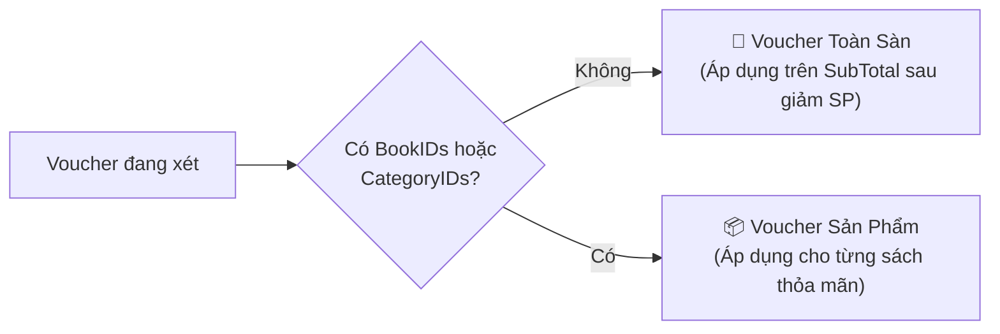
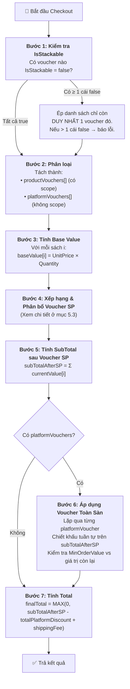
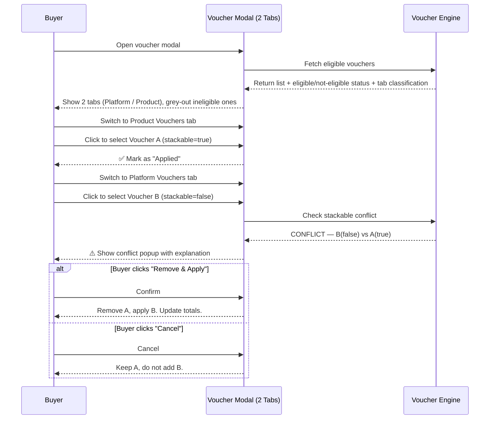

# 📋 Phân Tích Nghiệp Vụ: Luồng Áp Dụng Voucher — BookBlossom

> **Phiên bản:** 1.1  
> **Ngày tạo:** 2026-06-06  
> **Mục đích:** Đặc tả toàn bộ quy tắc nghiệp vụ cho việc áp dụng voucher trong quá trình Checkout (Cart & Mua lẻ Book Details / Blind Date Details)

> [!IMPORTANT]
> **Quy tắc ngôn ngữ:** Toàn bộ thông báo, label, tooltip, và nội dung hiển thị cho người dùng trên giao diện **PHẢI** bằng **tiếng Anh**.

---

## 1. Tổng Quan Hệ Thống Hiện Tại

### 1.1 Data Model liên quan

| Entity | File | Vai trò |
|---|---|---|
| `Voucher` | [Voucher.cs](file:///d:/VisualStudio/PBL3_BookBlossom/BookBlossom/BookBlossom.Core/Entities/Voucher.cs) | Chứa thông tin voucher, bao gồm `IsStackable`, `DiscountType`, `DiscountValue`, `MaxDiscountAmount`, `MinOrderValue` |
| `VoucherBook` | [Voucher.cs#L89-L97](file:///d:/VisualStudio/PBL3_BookBlossom/BookBlossom/BookBlossom.Core/Entities/Voucher.cs#L89-L97) | Bảng trung gian — sách cụ thể được áp dụng voucher |
| `VoucherCategory` | [Voucher.cs#L78-L86](file:///d:/VisualStudio/PBL3_BookBlossom/BookBlossom/BookBlossom.Core/Entities/Voucher.cs#L78-L86) | Bảng trung gian — danh mục sách được áp dụng voucher |
| `Order` | [Order.cs](file:///d:/VisualStudio/PBL3_BookBlossom/BookBlossom/BookBlossom.Core/Entities/Order.cs) | Đơn hàng — hiện chỉ có **1 trường** `VoucherID` (chỉ lưu được 1 voucher) |
| `OrderDetail` | [OrderDetail.cs](file:///d:/VisualStudio/PBL3_BookBlossom/BookBlossom/BookBlossom.Core/Entities/OrderDetail.cs) | Chi tiết đơn hàng — có trường `Discount` nhưng **hiện luôn bị gán = 0** |
| `CheckoutRequestDTO` | [CheckoutRequestDTO.cs](file:///d:/VisualStudio/PBL3_BookBlossom/BookBlossom/BookBlossom.Core/DTOs/CheckoutAndCreateOrder/CheckoutRequestDTO.cs) | Request checkout — hiện chỉ nhận **1 `VoucherCode` duy nhất** |

### 1.2 Các vấn đề nghiệp vụ đang tồn tại (GAP Analysis)

> [!CAUTION]
> Các lỗ hổng logic nghiêm trọng trong code hiện tại:

| # | Vấn đề | Vị trí code | Mô tả |
|---|---|---|---|
| 1 | **Giảm giá tính trên tổng đơn thay vì sách thỏa mãn** | [VoucherService.cs#L491-L510](file:///d:/VisualStudio/PBL3_BookBlossom/BookBlossom/BookBlossom.Infrastructure/Services/VoucherService.cs#L491-L510) | Voucher SP chỉ check scope match nhưng tính `discountAmount` trên toàn bộ `orderSubTotal`, kể cả sách không thuộc scope |
| 2 | **Chỉ hỗ trợ 1 voucher duy nhất** | [CheckoutRequestDTO.cs#L12](file:///d:/VisualStudio/PBL3_BookBlossom/BookBlossom/BookBlossom.Core/DTOs/CheckoutAndCreateOrder/CheckoutRequestDTO.cs#L12) | `string? VoucherCode` — chỉ nhận 1 mã |
| 3 | **Trường `Discount` ở OrderDetail luôn = 0** | [OrderService.cs#L137](file:///d:/VisualStudio/PBL3_BookBlossom/BookBlossom/BookBlossom.Infrastructure/Services/OrderService.cs#L137) | `Discount = 0` — không ghi nhận giảm giá cấp sản phẩm |
| 4 | **Order chỉ lưu 1 `VoucherID`** | [Order.cs#L28](file:///d:/VisualStudio/PBL3_BookBlossom/BookBlossom/BookBlossom.Core/Entities/Order.cs#L28) | `long? VoucherID` — không hỗ trợ nhiều voucher |
| 5 | **Trường `IsStackable` chưa được sử dụng** | [VoucherService.cs](file:///d:/VisualStudio/PBL3_BookBlossom/BookBlossom/BookBlossom.Infrastructure/Services/VoucherService.cs) | Được lưu trữ nhưng không tham gia vào bất kỳ logic kiểm tra nào |
| 6 | **FE tính discount chưa chuẩn** | [_CartScripts.cshtml#L311-L437](file:///d:/VisualStudio/PBL3_BookBlossom/BookBlossom/BookBlossom.Web/Views/Order/Partials/_CartScripts.cshtml#L311-L437) | Tính trên subtotal chung, không phân bổ từng sách, chưa xử lý IsStackable |

---

## 2. Phân Loại Voucher (Thiết Kế Mới)

Hệ thống phân loại voucher dựa trên **phạm vi áp dụng (scope)**, không thêm trường mới mà sử dụng dữ liệu hiện có:

### 2.1 Voucher Toàn Sàn (Platform-wide Voucher)

- **Điều kiện nhận diện:** Voucher **KHÔNG có** bản ghi nào trong bảng `VoucherBook` VÀ `VoucherCategory`.
  - Tức là: `ApplicableBookIDs.Count == 0` VÀ `ApplicableCategoryIDs.Count == 0`
- **Cách tính:** Áp dụng trên **tổng giá trị đơn hàng** (sau khi đã trừ Voucher Sản Phẩm). Nếu có nhiều Voucher Toàn Sàn, áp dụng **chiết khấu tuần tự** giống Voucher SP (voucher sau tính trên giá trị còn lại sau voucher trước).
- **Giới hạn:** Có thể áp dụng **nhiều** Voucher Toàn Sàn trong cùng 1 đơn hàng nếu tất cả đều có `IsStackable = true`. Nếu có bất kỳ voucher nào `IsStackable = false`, chỉ được chọn duy nhất voucher đó (tuân theo quy tắc IsStackable ở mục 4).

### 2.2 Voucher Sản Phẩm (Product-scoped Voucher)

- **Điều kiện nhận diện:** Voucher **CÓ** ít nhất 1 bản ghi trong bảng `VoucherBook` HOẶC `VoucherCategory`.
  - Tức là: `ApplicableBookIDs.Count > 0` HOẶC `ApplicableCategoryIDs.Count > 0`
- **Cách tính:** Chỉ áp dụng trên **giá trị của những cuốn sách thỏa mãn điều kiện** trong giỏ hàng.
- **Giới hạn:** Có thể áp dụng nhiều Voucher SP trong cùng 1 đơn (tùy thuộc `IsStackable`).



---

## 3. Quy Tắc `MinOrderValue` (Giá Trị Đơn Hàng Tối Thiểu)

> [!IMPORTANT]
> `MinOrderValue` phải được so sánh với **phạm vi tương ứng** của loại voucher, không phải luôn so với tổng giỏ hàng.

| Loại Voucher | `MinOrderValue` so sánh với |
|---|---|
| **Voucher Toàn Sàn** | Tổng giá trị toàn bộ giỏ hàng (`SubTotal`) |
| **Voucher Sản Phẩm** | Tổng giá trị của **chỉ** những cuốn sách trong giỏ mà **thỏa mãn** điều kiện scope (BookID/CategoryID) của voucher đó |

**Ví dụ minh họa:**
- Voucher "KINHDOANH50K" giảm 50.000đ cho danh mục "Kinh Tế", `MinOrderValue = 200.000đ`.
- Giỏ hàng: Sách Kinh Tế (50.000đ) + Truyện Tranh (150.000đ). Tổng = 200.000đ.
- **So sánh:** `MinOrderValue` (200K) vs Tổng sách Kinh Tế thỏa mãn (50K) → **50K < 200K → KHÔNG đủ điều kiện**.
- Nếu so với tổng giỏ hàng (200K) thì sẽ sai → Cuốn sách Kinh Tế 50K được giảm 50K = 0đ (phi logic).

---

## 4. Quy Tắc `IsStackable` (Cho Phép Cộng Dồn)

### 4.1 Định nghĩa

`IsStackable` trả lời câu hỏi: **"Voucher này có chấp nhận đứng chung với các voucher khác trong cùng 1 đơn hàng hay không?"**

### 4.2 Quy tắc cốt lõi

> [!IMPORTANT]
> **Quy tắc vàng:** Nếu trong danh sách voucher mà Buyer muốn áp dụng có **BẤT KỲ 1 VOUCHER NÀO** có `IsStackable = false`, thì danh sách đó chỉ được phép chứa **DUY NHẤT** voucher đó. Voucher `IsStackable = false` mang tính **ĐỘC QUYỀN** — "Nếu đã chọn tao, thì cấm chọn thêm ai khác".

### 4.3 Ma trận các kịch bản

| # | Kịch bản | Kết quả | Giải thích |
|---|---|---|---|
| 1 | N × Voucher SP (`stackable=true`) + M × Voucher Toàn Sàn (`stackable=true`) | ✅ **HỢP LỆ** | Tất cả đều cho phép cộng dồn. Trừ SP trước, Toàn Sàn tuần tự sau. |
| 2 | 2 × Voucher SP (`stackable=true`) + 1 × Voucher Toàn Sàn (`stackable=false`) | ❌ **KHÔNG HỢP LỆ** | Voucher Toàn Sàn yêu cầu độc quyền → Chỉ được chọn 1 trong 2 phương án. |
| 3 | 1 × Voucher SP (`stackable=false`) + 1 × Voucher SP (`stackable=false`) | ❌ **KHÔNG HỢP LỆ** | Cả hai đều yêu cầu độc quyền → Chỉ được chọn 1. |
| 4 | 1 × Voucher SP (`stackable=false`) + 1 × Voucher Toàn Sàn (`stackable=true`) | ❌ **KHÔNG HỢP LỆ** | Voucher SP (false) từ chối đứng chung → Chỉ được chọn 1. |
| 5 | 1 × Voucher SP (`stackable=true`) + 1 × Voucher Toàn Sàn (`stackable=false`) | ❌ **KHÔNG HỢP LỆ** | Voucher Toàn Sàn (false) từ chối → Chỉ được chọn 1. |
| 6 | 3 × Voucher SP (`stackable=true`) | ✅ **HỢP LỆ** | Tất cả cho phép cộng dồn. Phân bổ cho các sách theo thuật toán ưu tiên. |
| 7 | 1 × Voucher Toàn Sàn (`stackable=false`) dùng một mình | ✅ **HỢP LỆ** | Chỉ có 1 voucher, không ai cạnh tranh. |
| 8 | 2 × Voucher Toàn Sàn (`stackable=true`) | ✅ **HỢP LỆ** | Cả hai cho phép cộng dồn. Áp dụng tuần tự trên SubTotal. |
| 9 | 2 × Voucher Toàn Sàn (`stackable=true`) + 1 × Voucher Toàn Sàn (`stackable=false`) | ❌ **KHÔNG HỢP LỆ** | 1 cái false → chỉ được chọn duy nhất cái đó. |

### 4.4 Stacking ở cấp sản phẩm (Cộng dồn nhiều voucher trên 1 cuốn sách)

> [!NOTE]
> Quy tắc "mỗi sách chỉ ăn 1 voucher" **CHỈ ÁP DỤNG** khi tất cả voucher SP có `IsStackable = false`.

Khi **TẤT CẢ** voucher SP trong danh sách đều có `IsStackable = true`:
- Nếu số voucher SP > số dòng sách thỏa mãn: Các voucher dư ra sẽ được áp dụng tiếp (cộng dồn) lên cùng một sách, sử dụng phương pháp **Chiết khấu tuần tự** (Sequential Discounting).
- Nếu số voucher SP ≤ số dòng sách thỏa mãn: Mỗi sách ăn 1 voucher theo thuật toán ưu tiên.

---

## 5. Thuật Toán Phân Bổ Voucher (Greedy + Sequential Discounting)

### 5.1 Nguyên tắc cốt lõi: Chiết khấu tuần tự

> [!WARNING]
> Khi 1 cuốn sách được áp dụng nhiều voucher cộng dồn, mỗi voucher tiếp theo **BẮT BUỘC** phải tính trên **giá trị còn lại sau khi đã trừ voucher trước đó**, KHÔNG PHẢI trên giá gốc.

**Tại sao?**
- *Nếu tính trên giá gốc:* Sách 100.000đ, Voucher 1 giảm 50%, Voucher 2 giảm 60% → Tổng giảm = 50K + 60K = 110K → **Âm 10K (lỗ)**.
- *Nếu tính tuần tự:* Sách 100.000đ → Voucher 1 (50%) → Còn 50.000đ → Voucher 2 (60% trên 50K) → Giảm thêm 30K → **Khách trả 20.000đ (an toàn)**.

### 5.2 Thuật toán chi tiết

```
INPUT:
  - cartItems[]: Danh sách sách trong giỏ (đã chọn), mỗi item có: BookID, CategoryID, UnitPrice, Quantity
  - voucherList[]: Danh sách voucher được buyer chọn

OUTPUT:
  - finalTotal: Tổng tiền khách phải trả
  - discountPerItem[]: Số tiền được giảm cho từng OrderDetail

ALGORITHM:
```



### 5.3 Chi tiết Bước 4 — Phân bổ Voucher Sản Phẩm

```
productVouchers[] = voucher SP được sắp xếp theo thứ tự ưu tiên:
  1. Voucher Percentage trước (giảm % trước giảm cố định)
  2. Trong cùng loại, voucher có DiscountValue cao hơn xếp trước

cartLines[] = các dòng sách, mỗi dòng có currentValue = UnitPrice × Quantity

REPEAT cho đến khi hết productVouchers[]:
    Lấy voucher V tiếp theo trong danh sách
    
    eligibleLines[] = lọc các dòng sách thỏa mãn scope của V
                      VÀ tổng currentValue của eligibleLines >= V.MinOrderValue
    
    IF eligibleLines rỗng:
        Bỏ qua V (voucher không đủ điều kiện)
        CONTINUE
    
    Sắp xếp eligibleLines theo currentValue GIẢM DẦN
    
    Chọn targetLine = eligibleLines[0]  (sách có giá trị cao nhất)
    
    IF V.DiscountType == Percentage:
        rawDiscount = targetLine.currentValue × V.DiscountValue / 100
        discount = MIN(rawDiscount, V.MaxDiscountAmount)  // nếu MaxDiscountAmount > 0
    ELSE (Fixed):
        discount = V.DiscountValue
    
    // Đảm bảo không giảm quá giá trị còn lại
    discount = MIN(discount, targetLine.currentValue)
    
    targetLine.currentValue -= discount
    targetLine.totalDiscount += discount

END REPEAT
```

> [!TIP]
> **Điểm mấu chốt:** Ở mỗi vòng lặp, `currentValue` của sách luôn được cập nhật SAU khi áp dụng voucher trước đó (chiết khấu tuần tự). Voucher tiếp theo sẽ nhìn vào `currentValue` mới (đã giảm) để tính toán, đảm bảo không bao giờ âm.

### 5.4 Ví dụ minh họa đầy đủ

**Giỏ hàng:**

| Sách | Giá | Qty | Base Value | Category |
|---|---|---|---|---|
| Sách A | 200.000đ | 1 | 200.000đ | Kinh tế |
| Sách B | 150.000đ | 2 | 300.000đ | Văn học |
| Sách C | 80.000đ | 1 | 80.000đ | Kinh tế |

**Voucher được chọn (tất cả `IsStackable = true`):**

| Voucher | Loại | Scope | DiscountType | Value | MaxDiscount | MinOrder |
|---|---|---|---|---|---|---|
| V1 | SP | Category: Kinh tế | Percentage | 20% | 100.000đ | 0đ |
| V2 | SP | Category: Văn học, Kinh tế | Fixed | 30.000đ | — | 0đ |
| V3 | Toàn Sàn | — | Percentage | 10% | 50.000đ | 100.000đ |

**Quá trình tính toán:**

````carousel
### 🔄 Vòng 1 — Áp dụng V1 (Percentage 20%, Scope: Kinh tế)

Sách thỏa mãn: Sách B (**300K** — cao nhất trong Kinh tế+Văn học? Không, chỉ Kinh tế)  
→ Sách A (200K) và Sách C (80K) thỏa mãn  
→ Chọn **Sách A** (200K — cao nhất)

```
Giảm = 200.000 × 20% = 40.000đ  (< MaxDiscount 100K → OK)
Sách A: currentValue = 200.000 - 40.000 = 160.000đ ✅
```
<!-- slide -->
### 🔄 Vòng 2 — Áp dụng V2 (Fixed 30.000đ, Scope: Văn học + Kinh tế)

Sách thỏa mãn: Sách A (160K), Sách B (300K), Sách C (80K)  
→ Chọn **Sách B** (300K — cao nhất currentValue)

```
Giảm = 30.000đ (Fixed)
Sách B: currentValue = 300.000 - 30.000 = 270.000đ ✅
```
<!-- slide -->
### 🔄 Bước cuối — Áp dụng V3 (Toàn Sàn, 10%, Max 50K)

```
SubTotal sau SP = 160.000 + 270.000 + 80.000 = 510.000đ
MinOrderValue (100K) vs SubTotal (510K) → ĐỦ ĐIỀU KIỆN

Giảm = 510.000 × 10% = 51.000đ → Nhưng Max = 50.000đ
→ Giảm = 50.000đ

FinalTotal = 510.000 - 50.000 + 30.000 (ship) = 490.000đ ✅
```

**Tổng giảm: 40K + 30K + 50K = 120.000đ**
````

---

## 6. Sàn Giá 0đ — Chống Âm Tiền

> [!CAUTION]
> **Quy tắc bắt buộc:** Tổng tiền đơn hàng (Final Total) **KHÔNG BAO GIỜ** được phép âm. Nếu tổng giảm giá vượt quá giá trị đơn hàng, Final Total sẽ được đặt về **0đ**.

Áp dụng ở **2 cấp độ**:

### Cấp 1: Cấp sản phẩm (OrderDetail)
```
discount = MIN(discount, currentValue)
// Sau khi trừ: currentValue >= 0 luôn đúng
```

### Cấp 2: Cấp đơn hàng (Order)
```
finalTotal = MAX(0, subTotal - totalProductDiscount - platformDiscount + shippingFee)
```

---

## 7. Đặc Tả UX/UI — Xử Lý Xung Đột Voucher Trên Giao Diện

### 7.1 Nguyên tắc UX

Khi buyer bấm chọn một voucher mà gây ra xung đột `IsStackable`, giao diện **KHÔNG ĐƯỢC**:
- ❌ Chuyển xám (grey-out) voucher đó — vì voucher đó vẫn đủ điều kiện áp dụng, chỉ là không thể kết hợp với voucher đã chọn.
- ❌ Im lặng bỏ qua — buyer sẽ không hiểu tại sao.

Giao diện **PHẢI**:
- ✅ Hiển thị **thông báo giải thích rõ ràng** tại sao không thể chọn thêm.
- ✅ Chỉ rõ buyer cần **bỏ voucher nào** nếu muốn chọn voucher mới.
- ✅ Cho phép buyer **tự quyết định** giữ voucher cũ hay đổi sang voucher mới.

### 7.2 Các trường hợp xung đột và thông báo tương ứng

> [!NOTE]
> Tất cả thông báo hiển thị cho người dùng **PHẢI** bằng tiếng Anh.

#### Trường hợp 1: Buyer đã chọn Voucher A (`stackable=true`), bấm chọn thêm Voucher B (`stackable=false`)

```
⚠️ Voucher "[Voucher B Name]" cannot be combined with other vouchers.

To use this voucher, you need to remove:
  • [Voucher A Name] (Code: VOUCHER_A_CODE)

[Remove & Apply]    [Cancel]
```

#### Trường hợp 2: Buyer đã chọn Voucher A (`stackable=false`), bấm chọn thêm Voucher B (bất kỳ)

```
⚠️ The currently applied voucher "[Voucher A Name]" does not allow combining with other vouchers.

To use "[Voucher B Name]", you need to remove:
  • [Voucher A Name] (Code: VOUCHER_A_CODE)

[Remove & Apply]    [Cancel]
```

#### Trường hợp 3: Buyer đã chọn nhiều voucher (`stackable=true`), bấm chọn thêm Voucher C (`stackable=false`)

```
⚠️ Voucher "[Voucher C Name]" cannot be combined with other vouchers.

To use this voucher, you need to remove all currently applied vouchers:
  • [Voucher A Name] (Code: CODE_A)
  • [Voucher B Name] (Code: CODE_B)

[Remove All & Apply]    [Cancel]
```

### 7.3 Phân biệt "Không đủ điều kiện" vs "Xung đột Stackable"

| Tình huống | Hiển thị UI | Có thể tương tác? |
|---|---|---|
| Voucher hết hạn / chưa đủ MinOrder / sai scope / chưa đủ rank | 🔘 **Grey-out** + label "Not Eligible" | ❌ Không |
| Voucher đủ điều kiện nhưng **xung đột IsStackable** với voucher đang chọn | 🟡 **Vẫn sáng bình thường** + bấm được | ✅ Có — bấm vào sẽ hiện thông báo giải thích |

### 7.4 Thiết kế Voucher Modal — 2 Tab

Danh sách voucher trên cả 3 trang (Cart, Book Details, Blind Date Details) sẽ hiển thị trong modal với **2 tab**:

| Tab | Tên hiển thị | Nội dung |
|---|---|---|
| Tab 1 | **🏪 Platform Vouchers** | Các voucher Toàn Sàn (không có scope BookID/CategoryID) |
| Tab 2 | **📦 Product Vouchers** | Các voucher Sản Phẩm (có scope BookID hoặc CategoryID) |

**Quy tắc hiển thị:**
- Mỗi tab hiển thị danh sách voucher tương ứng từ ví voucher của buyer.
- Voucher không đủ điều kiện (hết hạn, chưa đủ MinOrder, sai scope, chưa đủ rank...) → **Grey-out** + label `"Not Eligible"` ở cả 2 tab.
- Voucher đủ điều kiện nhưng xung đột IsStackable → **Vẫn sáng**, bấm vào sẽ hiện popup giải thích (xem mục 7.2).
- Buyer có thể chọn voucher từ **CẢ 2 TAB** cùng lúc (miễn không vi phạm IsStackable).
- Số lượng voucher đã chọn hiển thị dạng badge trên mỗi tab header: ví dụ `Platform Vouchers (1)`, `Product Vouchers (2)`.

**Mockup layout:**
```
┌──────────────────────────────────────────┐
│  Select Vouchers                    [✕]  │
├──────────────────────────────────────────┤
│  [ 🏪 Platform Vouchers (1) ]            │
│  [ 📦 Product Vouchers (2) ]             │
├──────────────────────────────────────────┤
│                                          │
│  ┌─────────────────────────────────────┐ │
│  │ SAVE20  │ Save 20% on all books    │ │
│  │  Code   │ Min order 100,000 VND    │ │
│  │         │ Exp: 12/31/2026  [Apply] │ │
│  └─────────────────────────────────────┘ │
│                                          │
│  ┌─────────────────────────────────────┐ │
│  │ WINTER  │ 50,000 VND off           │ │
│  │  Code   │ Min order 200,000 VND    │ │
│  │         │ Exp: 01/15/2027 [Applied]│ │
│  └─────────────────────────────────────┘ │
│                                          │
│  ┌─ greyed out ────────────────────────┐ │
│  │ VIP50   │ 50% off (VIP only)       │ │
│  │  Code   │ [Not Eligible]           │ │
│  └─────────────────────────────────────┘ │
│                                          │
├──────────────────────────────────────────┤
│  Selected: WINTER, BOOKFAN              │
│  [Remove All]            [Confirm]       │
└──────────────────────────────────────────┘
```

### 7.5 Mockup luồng tương tác



---

## 8. Áp Dụng Cho Trang Mua Lẻ (Book Details / Blind Date Details)

Logic áp dụng voucher khi mua lẻ 1 sản phẩm từ trang chi tiết **PHẢI ĐỒNG BỘ HOÀN TOÀN** với logic Cart:

- **Nền tính toán:** `Base Value = UnitPrice × Quantity` (chỉ có 1 dòng sản phẩm duy nhất).
- **Nếu buyer áp dụng nhiều Voucher SP (`stackable=true`):**
  - Voucher 1 (ưu tiên voucher giảm nhiều nhất) áp dụng trên `Base Value`.
  - Ra được **Giá trị còn lại 1**.
  - Voucher 2 áp dụng trên **Giá trị còn lại 1** (chiết khấu tuần tự).
  - ... Tiếp tục cho đến hết danh sách.
- **Cuối cùng, nếu có Voucher Toàn Sàn:** Tính trên **Giá trị còn lại cuối cùng**.

---

## 9. Tổng Kết Công Thức Tính Toán

```
┌──────────────────────────────────────────────────────────────┐
│                  CÔNG THỨC CHECKOUT                          │
│                                                              │
│  Base Value (mỗi sách)  = UnitPrice × Quantity               │
│                                                              │
│  [Vòng lặp Voucher SP — Chiết khấu tuần tự]                 │
│  currentValue[i] -= discount_from_voucher_SP_k               │
│  (k = 1, 2, 3... lần lượt từng voucher SP)                   │
│                                                              │
│  SubTotal Sau SP = Σ currentValue[i]                         │
│                                                              │
│  [Vòng lặp Voucher Toàn Sàn — Chiết khấu tuần tự]           │
│  currentSubTotal -= discount_from_platformVoucher_j           │
│  (j = 1, 2, 3... lần lượt từng voucher Toàn Sàn)             │
│                                                              │
│  Final = MAX(0, currentSubTotal + Shipping Fee)               │
└──────────────────────────────────────────────────────────────┘
```

---

## 10. Danh Sách File Cần Sửa Đổi Khi Implement

> [!NOTE]
> Danh sách này là tổng hợp các file cần thay đổi để implement toàn bộ nghiệp vụ voucher mới.

### Backend (C#)

| File | Thay đổi |
|---|---|
| [CheckoutRequestDTO.cs](file:///d:/VisualStudio/PBL3_BookBlossom/BookBlossom/BookBlossom.Core/DTOs/CheckoutAndCreateOrder/CheckoutRequestDTO.cs) | `string? VoucherCode` → `List<string> VoucherCodes` |
| [Order.cs](file:///d:/VisualStudio/PBL3_BookBlossom/BookBlossom/BookBlossom.Core/Entities/Order.cs) | Thêm bảng trung gian `OrderVoucher` hoặc đổi `VoucherID` → hỗ trợ nhiều voucher |
| [VoucherService.cs](file:///d:/VisualStudio/PBL3_BookBlossom/BookBlossom/BookBlossom.Infrastructure/Services/VoucherService.cs) | Viết lại `ValidateAndApplyVoucherAsync` → hỗ trợ validate + phân bổ cho từng sách |
| [IVoucherService.cs](file:///d:/VisualStudio/PBL3_BookBlossom/BookBlossom/BookBlossom.Core/Interfaces/Services/IVoucherService.cs) | Cập nhật interface signature |
| [OrderService.cs](file:///d:/VisualStudio/PBL3_BookBlossom/BookBlossom/BookBlossom.Infrastructure/Services/OrderService.cs) | Sửa `CreateOrderAsync` — gọi engine mới, ghi `Discount` vào `OrderDetail`, lưu nhiều voucher |
| [VoucherValidationResultDTO](file:///d:/VisualStudio/PBL3_BookBlossom/BookBlossom/BookBlossom.Core/DTOs) | Thêm DTO mới cho kết quả phân bổ chi tiết từng item |

### Frontend (JS / CSHTML)

| File | Thay đổi |
|---|---|
| [_CartScripts.cshtml](file:///d:/VisualStudio/PBL3_BookBlossom/BookBlossom/BookBlossom.Web/Views/Order/Partials/_CartScripts.cshtml) | Viết lại `calculateTotals()`, thêm logic IsStackable conflict check, thêm popup giải thích xung đột |
| [_CartSection.cshtml](file:///d:/VisualStudio/PBL3_BookBlossom/BookBlossom/BookBlossom.Web/Views/Order/Partials/_CartSection.cshtml) | Thêm modal/popup cho thông báo xung đột voucher |
| Trang Book Details / Blind Date Details | Đồng bộ logic voucher mới |
